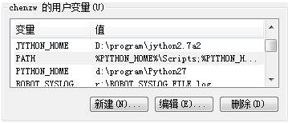
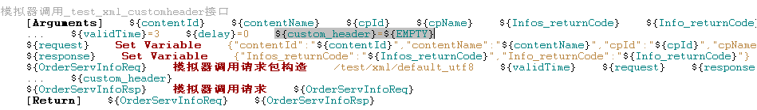
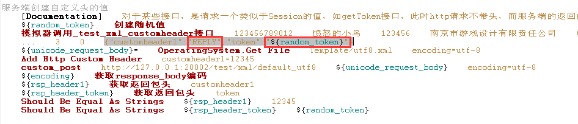

### 简单说明 ###
***
 - 用于“Mock V2”完成后的测试工作
 - 目前主要测试: custom encoding, custom header, xpath校验
 - 也可用于未来使用Mock V2的参考实现(但需要考虑的是，不需要实现得这么复杂，例如加头信息是很简单的事)
 
### 安装部署 ###
***
#### 1. Python的安装
 - 下载并安装Python
    - <http://10.1.3.252:10000/python/ActivePython-2.7.10.12-win32-x86.msi>
 - 设置path变量
    - 用户变量**PYTHON_HOME**设置为Python的安装目录，例如:__C:\\Python27__
    - 用户变量**PATH**的最后加入:　__;%PYTHON_HOME%;%PYTHON_HOME%\\Scripts__
<p></p>    

 - 设置pip采用国内镜像
    - 编辑%HOMEPATH%\\pip\\pip.ini,　内容如下:
```ini
[global]
index-url=http://mirrors.aliyun.com/pypi/simple/
index-url2=https://pypi.mirrors.ustc.edu.cn/simple/
[install]
trusted-host=mirrors.aliyun.com
```    
 - 手工更新一下pip的版本
    命令行模式下 
```shell
    > pip install http://10.1.3.252:10000/python/pypi/pip-8.1.2-py2.py3-none-any.whl --upgrade 
``` 
#### 2. wxpython的安装
 - 下载并安装wxpython2.8
    - <http://10.1.3.252:10000/python/wxPython2.8-win32-unicode-2.8.12.1-py27.exe>

#### 3. 第三方库的安装，采用virtualenv的模式
##### 下载并执行安装脚本
 - 下载安装脚本－－ <http://10.1.3.252:10000/python/pypi/new_rf_vpython.py>
 - 执行脚本－－资源管理器中双击运行：new_rf_vpython.py，直到脚本安装完成（约2分钟）
   - 涉及到的主要库有: 
     - robotframework
     - wxpython
     - robotframework-ride
     - httplibrary
     - lxml
     - xmltodict
     - chardet
     - twisted
 - 命令行模式, 激活virtualenv，并启动虚拟环境下的ride
```shell
    > cmd /K cd c:\vpython\scripts
    > activate.bat
    > python ride.py
```

### 使用说明 ###
***
#### IDE方式运行
 - Ride.py装载Demo目录
 - 配置Mock Server中的模拟服务器,　然后运行起来
 - 按需要运行Demo中json和xml两个目录下的，自定义头和自定义编码的案例

#### 自测式cmd运行
 - 先激活virtualenv, 然后在cmd窗口下，进入Demo目录，运行 SimServer\docs\Demo\do_test.cmd,  其过程如下:
```shell
 > 立即启动SimServer.py
 > 5秒后, 通过pybot.cmd运行测试, 报告生成在SimServer\docs\Demo\report目录
 > 10秒后, 浏览器打开log.html,可以查看运行报告
 > 通过taskkill /IM python.exe 清除所有的python进程
```

### 详细说明 ###
***
#### 自定义头
1. 需求概述
     - 自定义头通常在真实系统中有两种情况:
       - Client发起请求中带了custom header, SimServer只需要在返回中带上同样的custom header, 其值与请求包相同
       - Client发起请求中没有带头, 但该请求是请求一个新的Custom header, 此时SimServer需要在返回包中给一个随机数

2. 配置说明
     - RF的Resource层关键字中,新增custom_header
       - 配置为{"key1":"value1","key2":value2"}
       - 如果value的配置为"REPLY",则按请求包的原值返回
       - 如果value的配置不是"REPLAY",则按指定值返回 
          > 也就是说, 随机数可以通过在RF的Client封装中完成指定值; 例如md5或者java加密,分别可以通过RF的python自定义lib和jython+RemoteLibrary来分别实现
       - 如果不配置custom_header, 则缺省传入的参数值为${EMPTY}, 则保持Mock V1中不带Custom Header时的兼容
       
         keyword图（ride）:
           <p></p>      
         testcase图（ride）:
           <p></p>      

3. 实现详解
    - 自定义头是通过RF的关键字来实现的
       - SimClient.py中新增header
       - 利用SimClient.py中的dict2xml,如果header不为空,则把header放在simSet接口XML包中去
           <p></p>     
       - SimServer中对SimSet接口的处理,如果存在header的内容,则把header相关的内容放在expMessage的实体中去
           <p></p>         
       - SimServer在返回包时判断,如果expMsg中存在header的定义,且value为**REPLY**,则取请求包中的值原样返回; 否则按expMsg中的header指定值加头返回
           <p></p>         
       

#### 自定义编码
1. 需求概述
     - TBD

2. 配置说明
     - 通过conf/system.xml中的配置实现
        - 配置当前只针对http server实现, 也就是说,一个端口的配置是定死的(大部分场景下, 一类接口的编码是一样的)
        - 如果不配置,缺省的encoding为UTF-8, 保持向Mock V1的兼容
        
            <p></p>
  
3. 实现详解
     - 自定义编码的实现如下
        - system.xml中http server中配置的encoding是最主要的判断因素, 返回包完全按此encoding返回
        - 保持template中实际的req和rsp模板在磁盘保存的编码,与上述一致
        - Http包体的编码检测,使用了第三方库chardet, 大部分情况下可以准确检测出来编码, 少量情况加入了一些判断,见utils/encoding.py文件中的detectEncoding()功能
        - 实现逻辑如下:
            - SimServer收到包, 按system.xml中的指定的编码进行转码, 在消息队列中匹配前面预置的expMsg实例,并根据expMsg实例设置返回包中的参数
            - 返回包体时,也是先检测包体的encoding
            - 对于XML包体的处理,通过转为UNICODE之后,再按system.xml中指定的编码转换后发出(注意,此时未显式指定http包头中的charset)
            - Json包体的处理和XML的处理还有一点不同,在于json.Loads()时,处理不了UNICODE多字节的情况,所以是Json包转XML时多了一步,即先转UTF-8
            - Json包体的处理, 由于是先转XML再处理,所以各种转码的工作需要考虑把第一行去除,否则第一行中的encoding声明会与包体的实际不一致

4. 其它
     - 根据http协议, 包头声明的encoding应与包体的encoding一致; 但现实世界中各系统的实现差异度较大, 所以SimServer目前基本上只考虑包体的实际encoding
     - 由于多编码的输出,都需要写日志,所以日志会打印包体的encoding,但写日志文件时全部转为UTF-8写文件,这一点在查看日志时需要注意.
     - 所谓的http的encoding支持, 实际上主要还是考虑UTF-8和GBK两种, UTF-8是UNICODE的一种编码实现, UTF-16LE也是UNICODE的一种编码实现,UTF-8占用的网络带宽少,所以UTF-16LE在网络上使用少
     - 根据RFC4627的定义, JSON的String缺省UTF-8, 也可以使用`\uxxxx`, 如果是后者,则有rspMsg.decode("**unicode-escape**").encode(encoding)
   

#### xpath校验
1. 需求概述
     - 对于某些接口，被测系统会向第三方发出group模式的xml包，例如NDMP项目；需要校验中间的某个节点值，因此增加xpath校验

2. 配置说明
     - 主要配置在于NNN接口.txt中，与接口相关的部分的KW
     - KW：“模拟器调用请求包构造”的最后二个参数“校验模式”和“应答模式”，缺省均为“NORMAL”, 需要进行XPATH校验时，需要设“校验模式”为“XPATH”
     - 传变量的参数，例如{"/Request/apkInfo/contentId":"${contentId}","/Request/apkInfo/contentName":"${contentName}"}

3. 实现详解
     - Demo例子，见：**Demo/接口案例/XML/01.HTTP简单请求测试.robot** 文件中的案例 “xpath验证模式”
